# GUIA CÒPIES DE SEGURETAT
---

## WINDOWS
### 1 Instal.lar màquina virtual
Crearem una màquina virtual amb Windows i afegirem un disc dur de 10 GB per emmagatzemar les còpies de seguretat.


### 2 Instal.lar duplicati
Accedim a la màquina virtual i descarreguem Duplicati des de la pàgina oficial. Un cop descarregat, seguim l’assistent d’instal·lació per completar el procés.


### 3 Passphrase
Duplicati demana una passphrase que servirà per xifrar totes les dades de la còpia de seguretat. Així que crearem una.


### 4 Backup local
Primer, seleccionem l'opció Add backup per començar a configurar la còpia de seguretat.


A continuació, introduïm una passphrase per xifrar el backup.


Després, indiquem la ruta del fitxer on es guardarà el backup i seleccionem el disc dur creat per allotjar-lo.


A continuació, triem les carpetes que volem incloure en la còpia de seguretat. En aquest exemple, s’ha seleccionat la carpeta Desktop.


Finalment, establim la programació del backup, configurant que es realitzi cada hora per mantenir les dades sempre actualitzades.


### 5 Backup google drive

Primer, seleccionem l'opció Add backup per començar a configurar la còpia de seguretat.


A continuació, escollim Google Drive com a destí. S'obrirà una finestra on haurem d'iniciar sessió amb un compte de Gmail. Un cop iniciada la sessió, se’ns proporcionarà un codi d’autenticació.


Introduïm aquest codi a l’apartat AuthID de Duplicati per validar l’accés a Google Drive.


Després, triem les carpetes que volem incloure en el backup. En aquest exemple, s’ha seleccionat la carpeta Desktop.


Finalment, establim la programació del backup, configurant que es realitzi cada dia per mantenir les dades sempre actualitzades.


### 6 Restaurar backup
Primer, comprovem que els nostres backups tenen almenys una versió disponible i, a continuació, seleccionem l’opció Restore.


Ara triem quin backup volem restaurar, ja sigui local o des de Google Drive.


Els resultats de la restauració són els següents:

**local:**


**google drive:**


## LINUX
### 1 Instal.lar màquina virtual
Crearem una màquina virtual amb Ubuntu Server i afegirem un disc dur de 10 GB per emmagatzemar les còpies de seguretat.

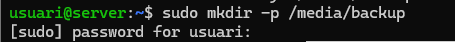

### 2 Formatejar
Formategem el disc dur amb el sistema de fitxers XFS:
```bash
sudo mkfs.xfs -f /dev/sdb1
```
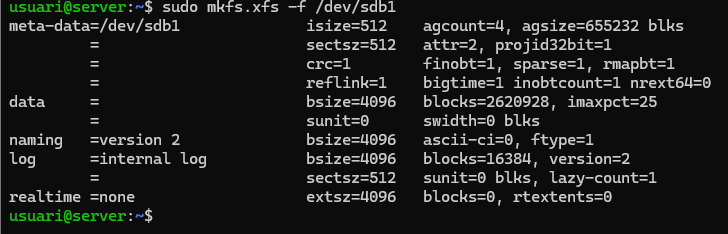

### 3 UUID
Obtenim el UUID del disc per afegir-lo al fitxer fstab i garantir que es monti correctament:
```bash
sudo blkid /dev/sdb1
```

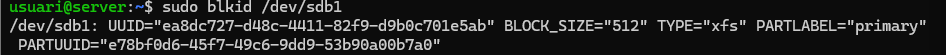

Copiem el UUID obtingut i obrim el fitxer fstab:
```bash
sudo nano /etc/fstb
```
Afegim una línia com aquesta per configurar el muntatge automàtic:
```bash
UUID=xxxx-xxxx /media/backup xfs noauto,defaults 0 2
```  
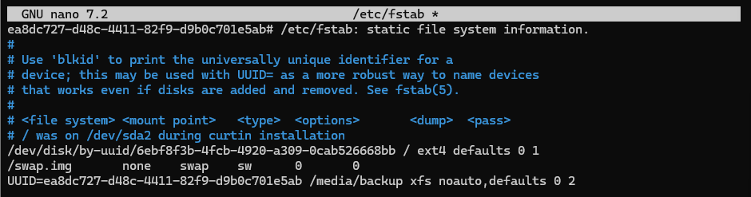

### 4 Instal.lar duplicity
Instal·lem l’eina de còpia de seguretat Duplicity:
```bash
sudo apt install duplicity
```
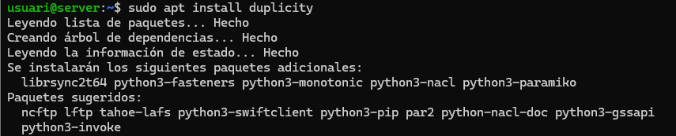

### 5 Crear usuaris
Creem els usuaris amb els seus directoris personals per provar backups separats:

```bash
sudo adduser user1
sudo adduser user2
```

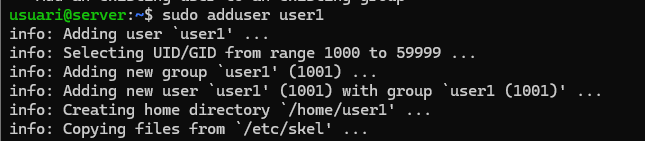
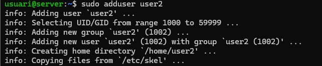

### 6 Crear archius
Generem quatre arxius de 10 MB cadascun per simular dades que es copiaran:
```bash
fallocate -l 10M file1.bin
fallocate -l 10M file2.bin
fallocate -l 10M file3.bin
fallocate -l 10M file4.bin
```
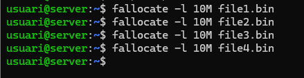

### 7 Copia
Primer establim la passphrase per xifrar les dades:
```bash
export PASSPHRASE='contrasenya'
```
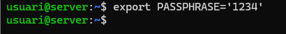


A continuació, fem la còpia completa del directori /home al directori de backup:
```bash
sudo duplicity full /home file:///media/backup
```

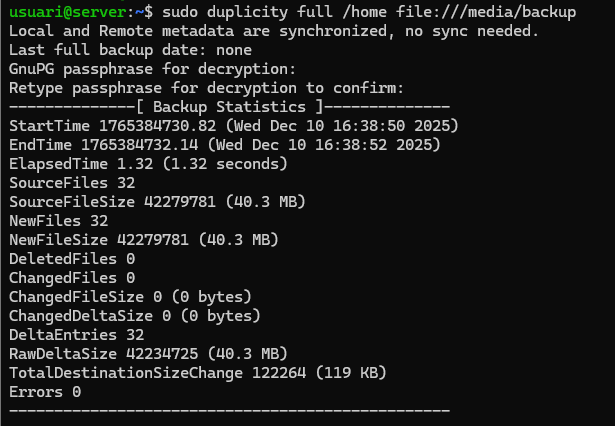


### 8 Remover axius
Per simular la pèrdua de dades, eliminem els fitxers creats anteriorment:
```bash
rm /home/usuari/file1.bin
rm /home/usuari/file2.bin
rm /home/usuari/file3.bin
rm /home/usuari/file4.bin
```
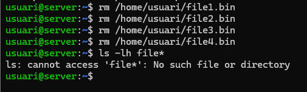

### 9 Restaurar els fitxers
Per recuperar els fitxers, utilitzem la comanda de restauració de Duplicity:
```bash
duplicity restore file:///media/backup /home/restore_test
```
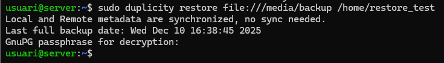

Finalment, comprovem que els fitxers s’han restaurat correctament:
```bash
ls -lh /home/restore_test/usuari
```


### 10 Copies incrementals
Per practicar amb backups incrementals, primer creem un nou fitxer de prova:
```bash
fallocate -l 4M file5.bin
```
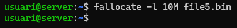

A continuació configurem la passphrase per xifrar el backup:
```bash
export PASSPHRASE='contrasenya_segura'
```
I fem la còpia incremental, que només guardarà els canvis respecte al backup complet anterior:
```bash
duplicity incremental /home file:///media/backup
```

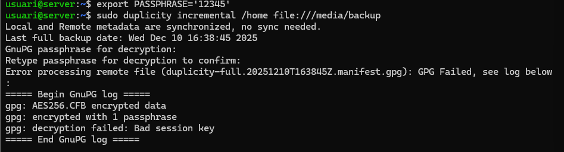


### 11 Desmontar
per demsontar
```bash
umount /media/backup
```
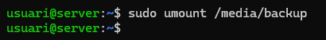


### 12 Fullbackup.sh
Crearem un script que automatitza el backup complet dels fitxers del sistema. Obrim el fitxer /root/fullbackup.sh i hi afegim el següent contingut:
```bash
#!/bin/bash
set -e
DEVICE="/dev/sdb1"
MOUNTPOINT="/media/backup"
LOG="/var/log/duplicity_full.log"
export PASSPHRASE="contrasenya_segura"
# Muntar (fa servir fstab si tens noauto)
mount "$MOUNTPOINT" || mount "$DEVICE" "$MOUNTPOINT"
date >> "$LOG"
echo "Inici full backup: $(date)" >> "$LOG"
duplicity full /home file://"$MOUNTPOINT"/backup >> "$LOG" 2>&1
echo "Finalitzat full backup: $(date)" >> "$LOG"
sync
umount "$MOUNTPOINT"
```

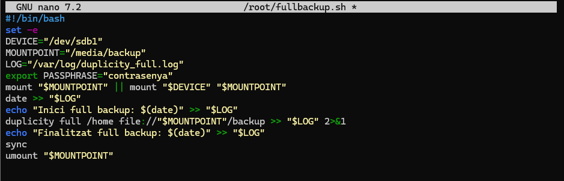


Un cop creat, fem l’script executable:
```bash
chmod +x /root/fullbackup.sh
```

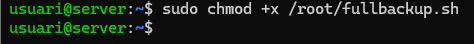

Finalment, programem l’execució automàtica cada diumenge a les 23:00 amb cron:
```bash
sudo crontab -e
```

Afegim la línia següent:
```bash
0 23 * * 0 /root/fullbackup.sh
```
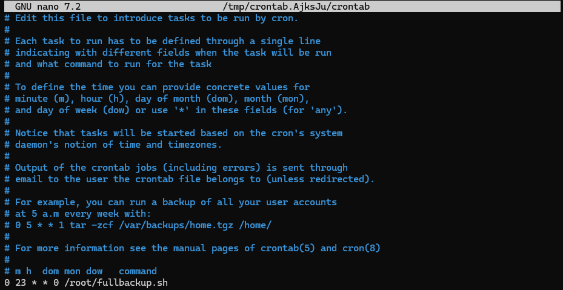


### 13 
Crearem un script que automatitza el backup complet dels fitxers del sistema. Obrim el fitxer /root/incrementalbackup.sh i hi afegim el següent contingut:
```bash
#!/bin/bash
set -e
DEVICE="/dev/sdb1"
MOUNTPOINT="/media/backup"
LOG="/var/log/duplicity_incr.log"
export PASSPHRASE="contrasenya_segura"
# Muntar
mount "$MOUNTPOINT" || mount "$DEVICE" "$MOUNTPOINT"
date >> "$LOG"
echo "Inici incremental backup: $(date)" >> "$LOG"
duplicity incremental /home file://"$MOUNTPOINT"/backup >> "$LOG" 2>&1
echo "Finalitzat incremental backup: $(date)" >> "$LOG"
sync
umount "$MOUNTPOINT"
```

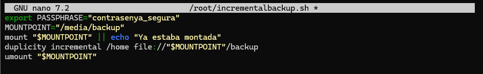


Un cop creat, fem l’script executable:
```bash
chmod +x /root/fullbackup.sh
```

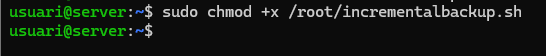

Finalment, programem l’execució automàtica cada diumenge a les 23:00 amb cron:
```bash
sudo crontab -e
```

Afegim la línia següent:
```bash
0 23 * * 1-6 /root/incrementalbackup.sh
```
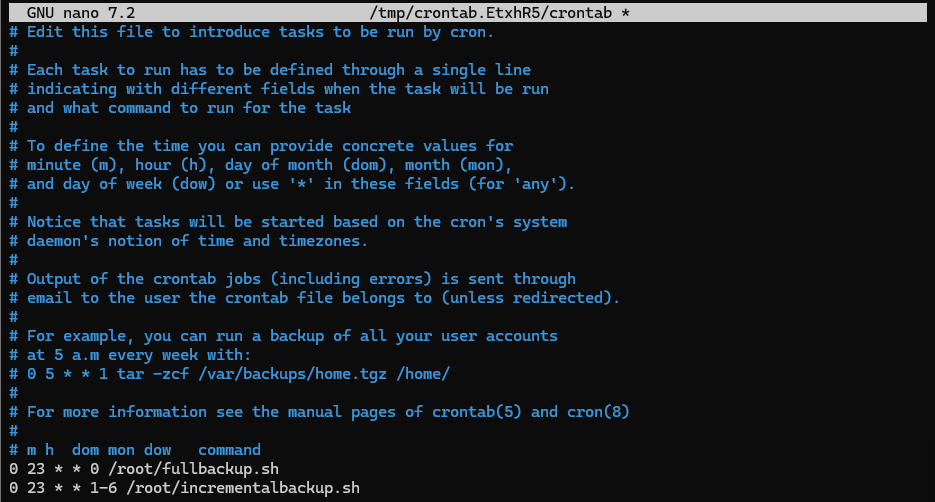
