# GUIA CÒPIES DE SEGURETAT
---

## WINDOWS
### 1 Instal.lar màquina virtual
Crearem una màquina virtual amb Windows i afegirem un disc dur de 10 GB per emmagatzemar les còpies de seguretat.

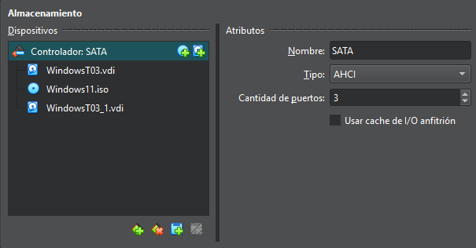

### 2 Instal.lar duplicati
Accedim a la màquina virtual i descarreguem Duplicati des de la pàgina oficial. Un cop descarregat, seguim l’assistent d’instal·lació per completar el procés.

### 3 Passphrase
Duplicati demana una passphrase que servirà per xifrar totes les dades de la còpia de seguretat. Així que crearem una.

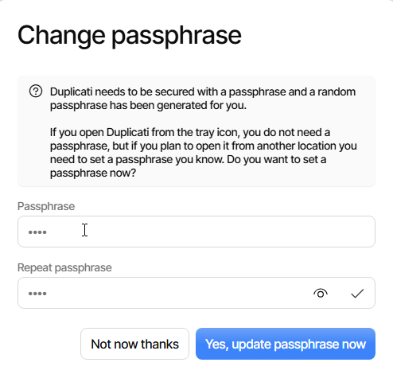

### 4 Backup local
Primer, seleccionem l'opció Add backup per començar a configurar la còpia de seguretat.

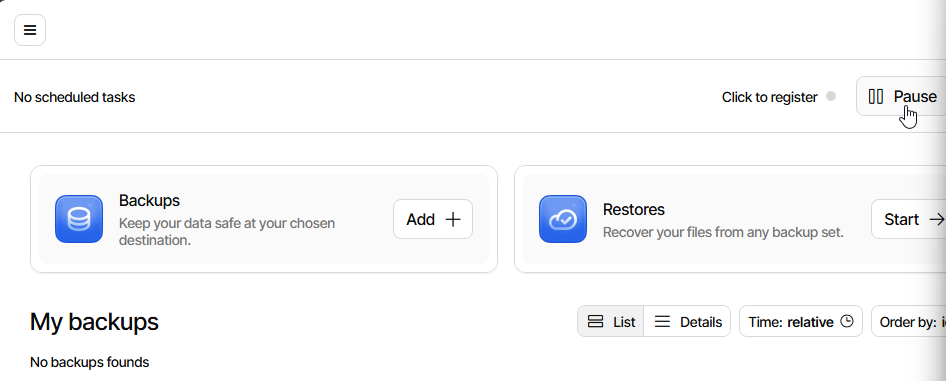

A continuació, introduïm una passphrase per xifrar el backup.

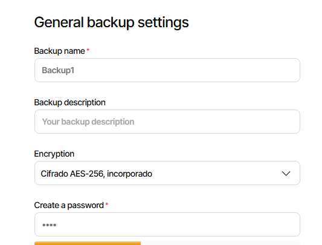

Després, indiquem la ruta del fitxer on es guardarà el backup i seleccionem el disc dur creat per allotjar-lo.

A continuació, triem les carpetes que volem incloure en la còpia de seguretat. En aquest exemple, s’ha seleccionat la carpeta Desktop.

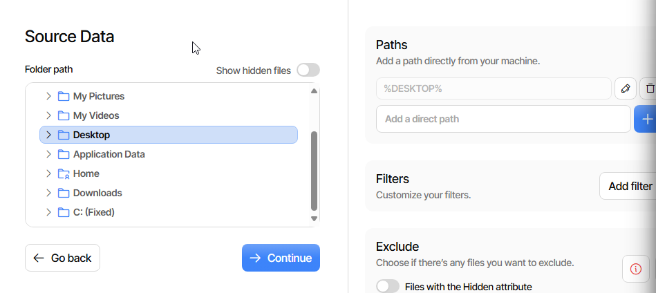

Finalment, establim la programació del backup, configurant que es realitzi cada hora per mantenir les dades sempre actualitzades.

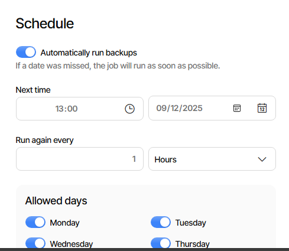

### 5 Backup google drive

Primer, seleccionem l'opció Add backup per començar a configurar la còpia de seguretat.

A continuació, escollim Google Drive com a destí. S'obrirà una finestra on haurem d'iniciar sessió amb un compte de Gmail. Un cop iniciada la sessió, se’ns proporcionarà un codi d’autenticació.

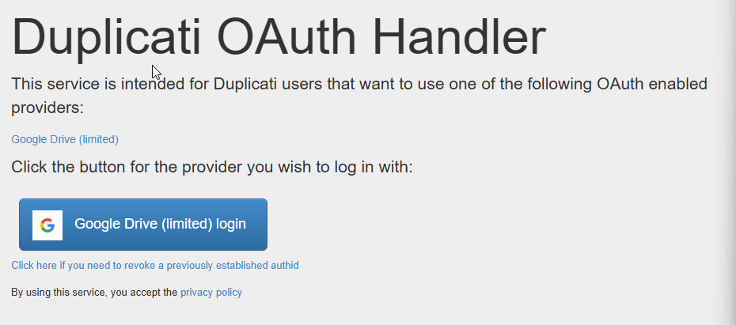
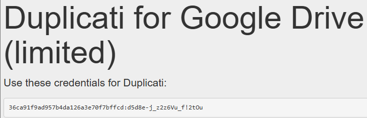

Introduïm aquest codi a l’apartat AuthID de Duplicati per validar l’accés a Google Drive.

Després, triem les carpetes que volem incloure en el backup. En aquest exemple, s’ha seleccionat la carpeta Desktop.

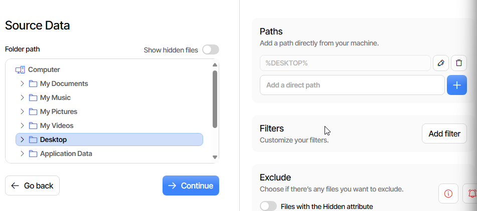

Finalment, establim la programació del backup, configurant que es realitzi cada dia per mantenir les dades sempre actualitzades.

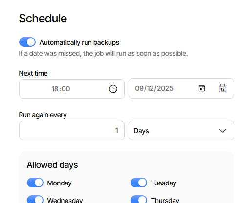

### 6 Restaurar backup
Primer, comprovem que els nostres backups tenen almenys una versió disponible i, a continuació, seleccionem l’opció Restore.

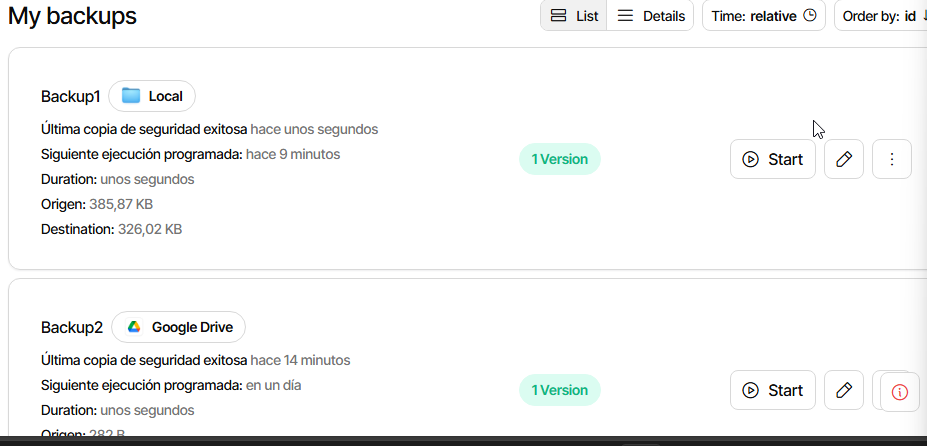
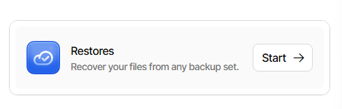

Ara triem quin backup volem restaurar, ja sigui local o des de Google Drive.

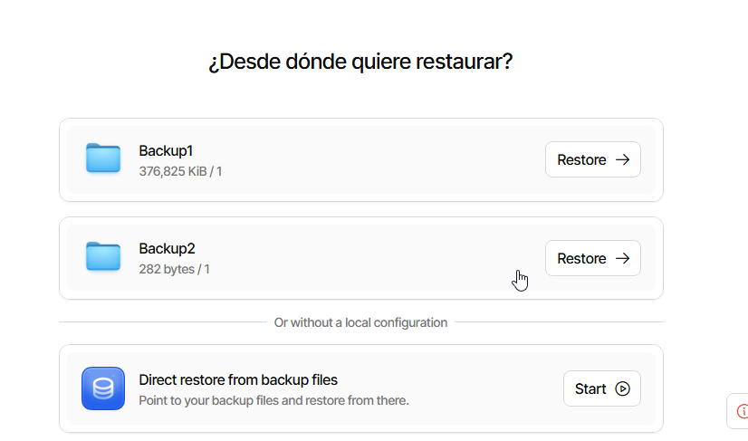

Els resultats de la restauració són els següents:

**local:**

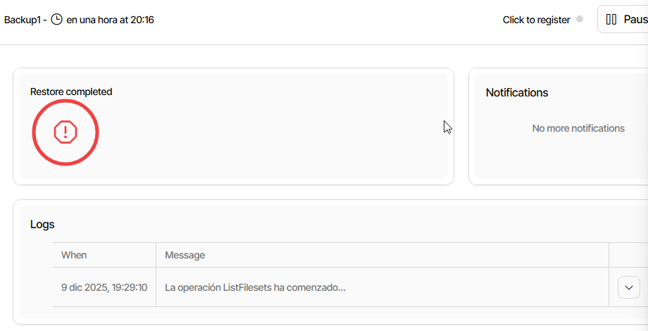

**google drive:**

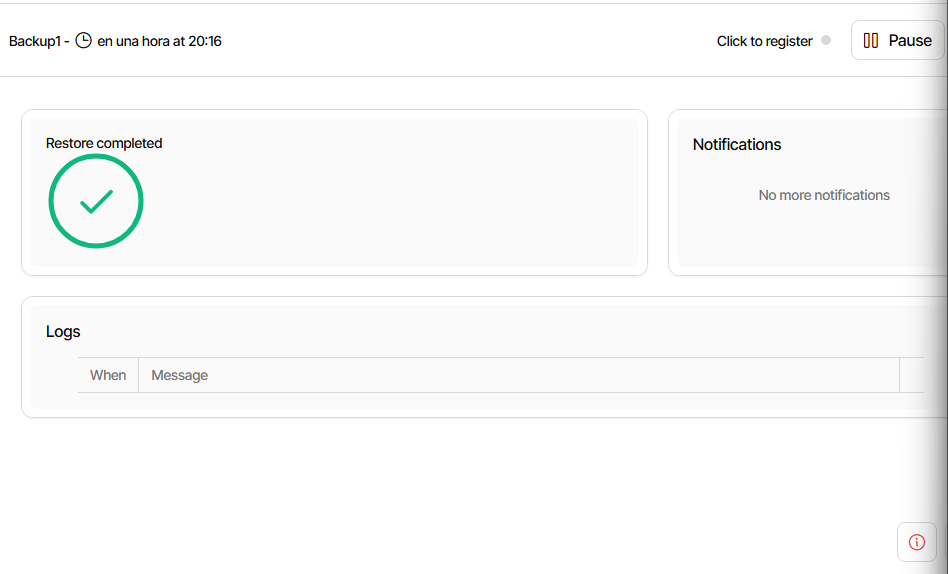

