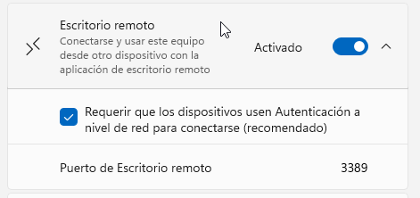
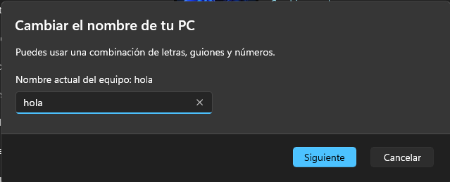
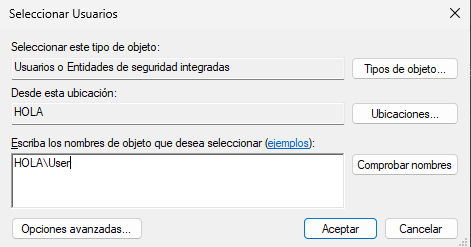
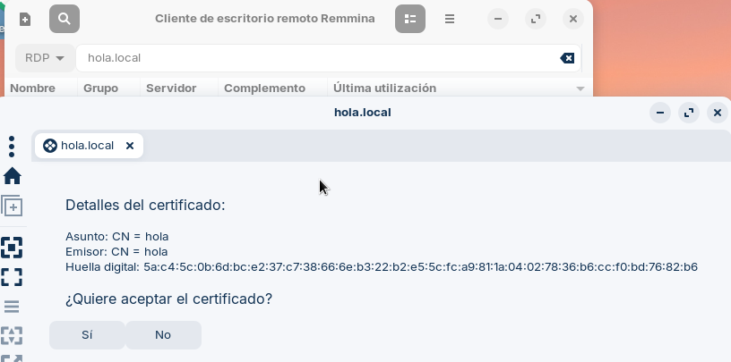
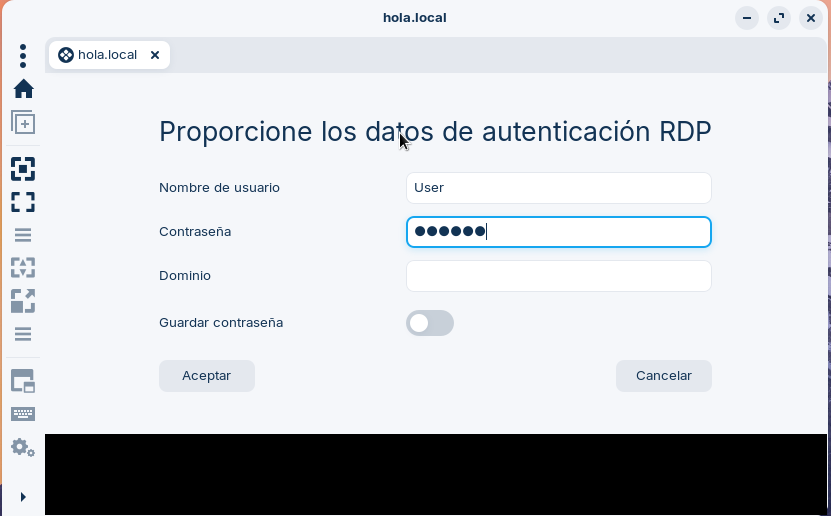
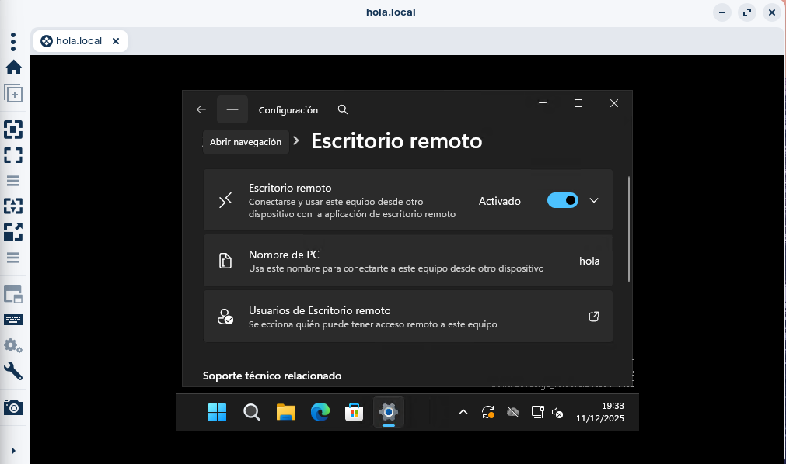

# GUIA T06
--- 

## 1) Màquines virtuals

Per començar, necessitarem dues màquines virtuals per practicar el suport remot. Aquestes màquines serviran com a entorn de prova sense tocar equips reals.

### Passos:

**-Instal·lar Windows 11:**

 - Crear una màquina virtual amb almenys 4 GB de RAM, 2 CPU i 60 GB de disc.

 - Crear un usuari amb permisos d’administrador.


**-Instal·lar Zorin OS:**

 - Crear una altra màquina virtual amb característiques similars (4 GB de RAM, 2 CPU, 20-40 GB de disc).

 - Crear un usuari amb permisos normals i, si cal, afegir-lo al grup sudo.


**-Xarxa:**

 - Posar a les dues màquines una connexió NAT per tenir Internet i una connexió “Host-Only” per poder comunicar-se entre elles.

 - Comprovar que es poden fer ping entre les dues màquines per assegurar que es veuen.

--- 

## 2) Remot

Per poder connectar-nos des d’un altre equip, primer hem d’activar i configurar l’Escriptori Remot a Windows 11. A continuació t’explico els passos de manera senzilla:

**1. Activar Escriptori Remot:**

- Obrim Configuració → Sistema → Escriptori remot.

- Activem l’opció Habilitar l’escriptori remot.



**2. Canviar el nom de l’ordinador:**

- Anem a Inici i a la part superior veurem el nom actual de l’ordinador.

- Cliquem a Canviar nom i escrivim un nom fàcil de recordar, per exemple HOLA.

- Reiniciem l’ordinador si ens ho demana.
  


**3. Afegir usuaris autoritzats:**

- Torna a Opcions de l’escriptori remot.

- Fes clic a Usuaris de l’escriptori remot.

- S’obrirà una finestra on podem afegir els usuaris que podran connectar-se.

- Escriu el nom de l’usuari amb el format:
```bash
HOLA\User
```

- Prem Acceptar per desar els canvis.




---

## 3) Acceptar certificat i entrar
Quan intentem connectar-nos per primera vegada amb l’Escriptori Remot, el sistema ens mostrarà un avís de seguretat. Això és normal i serveix per assegurar que la connexió és segura:

1. Apareixerà una finestra amb informació com Assumpte, Emissor i Empremta digital del certificat.
2. Ens pregunta si volem acceptar el certificat. Cliquem Sí per continuar.



3. A continuació, ens demanarà les credencials del nostre usuari de Windows.¡
 - Introduïm nom d’usuari i contrasenya.
 - Premem Acceptar i ja podrem accedir a l’escriptori remot del Windows 11 des de l’altra màquina.



---

## 4. Resultat final
Després de configurar tot el procés, la connexió per escriptori remot ha de funcionar correctament. Això significa:

- Des de la màquina Zorin podrem veure l’escriptori de Windows 11 tal com si estiguéssim davant del PC físic.

- Podem moure el ratolí, obrir programes i accedir a fitxers amb els permisos del compte amb què ens hem connectat.

- La connexió és segura gràcies al certificat acceptat anteriorment.





