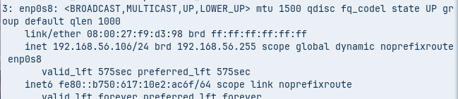
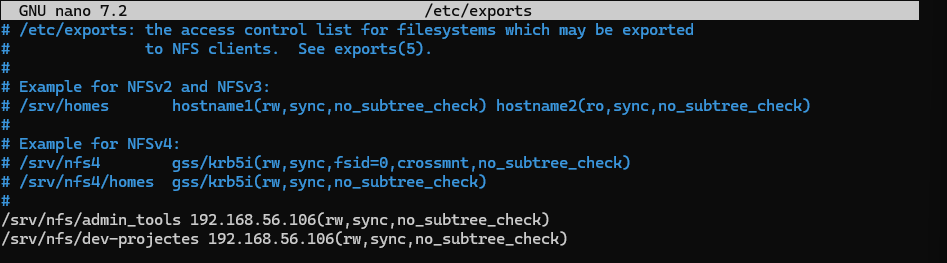
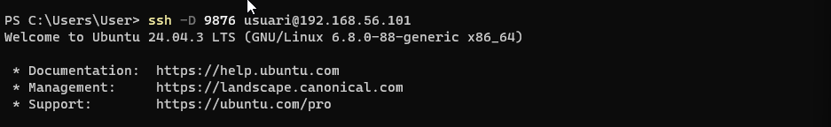

# GUIA SSH
---

## 0. Configuració inicial de les màquines virtuals

Abans de començar amb SSH, configurem les dues màquines virtuals:

- **Màquina 1:** Ubuntu Server  
- **Màquina 2:** Windows (client normal)  

**Configuració de xarxa:**  
- Afegir **un adaptador NAT** per a l'accés a Internet.  
- Afegir **un adaptador en mode Anfitrió (Host-only)** per a la comunicació directa entre les dues màquines.






## 1. Instal·lació del servei SSH

Per començar, instal·lem el servei SSH amb la comanda:

```bash
sudo apt install ssh
```

## 2. Comprovació del servei

Un cop instal·lat, podem verificar que el servei està actiu amb:
```bash
sudo systemctl status ssh
```

sudo systemctl status ssh


## 3. Connexió al servidor via SSH

Per connectar-nos al servidor, obrim PowerShell i executem la comanda:

```bash
ssh <nom_d'usuari>@<IP_del_servidor>
```
Després introduïm la contrasenya de l'usuari. Un cop verificada, establirem la connexió amb el servidor i podrem treballar de manera remota.


## 4. Comprovació de la connexió

Un cop connectats al servidor via SSH, podem verificar que estem treballant al sistema remot executant:

```bash
hostname
```


## 5. Afegir un usuari nou

Per crear un usuari nou al servidor, utilitzarem la comanda següent:

```bash
sudo adduser <nom_del_usuari>
```


## 6. Configuració del fitxer SSH

Per editar la configuració del servei SSH, obrim el fitxer `/etc/ssh/sshd_config` amb permisos de superusuari:

```bash
sudo nano /etc/ssh/sshd_config
```

Un cop dins, assegureu-vos de modificar o afegir les següents línies segons els requisits:

- Port 22 (*Activar el port 22*)
- LoginGraceTime 120 (*Temps d'espera per a login*)
- PermitRootLogin prohibit-password (*Denegar login directe de root amb contrasenya*)
- StrictModes yes (*Comprovar permisos dels fitxers i directoris*)
- RSAAuthentication yes (*Permetre autenticació RSA*)
- PubkeyAuthentication yes (*Permetre autenticació per clau pública*)
- AllowUsers <nom_d_usuari> (*Permetre només l'usuari especificat*)
  


Ara sortim del SSH amb:
```bash
exit
```
I provem d’entrar amb l’usuari creat:
```bash
ssh <nom d'usuari creat>@<IP del servidor>
```
Si apareix “Access denied” significa que la configuració és correcta.

# 7. Tunel SSH

Un túnel SSH ens permet redirigir el tràfic de xarxa d'una aplicació local a través de la connexió segura amb el servidor. Això és útil per navegar de manera segura o accedir a serveis restringits des de fora de la xarxa local.

Per crear un túnel dinàmic amb port forwarding, executeu la comanda següent des del client:

```bash
ssh -D 9876 usuari@192.168.56.101
```

- -D 9876: Configura un SOCKS proxy local al port 9876 del client.
- usuari@192.168.56.101: Dades d'accés al servidor SSH.

# 8.Configuració de xarxa al client Windows

Ara entrarem al client de Windows i configurarem la xarxa segons la informació de la imatge.

Passos a seguir:

1. Obrir les **Propietats d’Internet**.
2. Accedir a **Configuració de LAN**.
3. Activar l’opció **Usar proxy**.
4. Entrar a **Opcions avançades**.
5. Modificar el **SOCKS** i el **port** segons les dades de la imatge.


# 9. Instal·lació i ús de Wireshark
Després instal·larem **Wireshark** seguint aquests passos:

1. Anar a la pàgina oficial de Wireshark i descarregar el programa.
2. Instal·lar Wireshark seguint l’assistent d’instal·lació.
3. Obrir Wireshark.
4. Començar a capturar paquets a la interfície de xarxa corresponent.


# 10. Clau SSH (Keys)

Per permetre l’accés al servidor Ubuntu des del client sense necessitat de contrasenya, generarem un parell de claus SSH. Obrim **PowerShell** al client i executem:

```bash
ssh-keygen -t rsa
```


Per comprovar que les claus SSH s’han creat correctament, podem llistar el contingut de la carpeta `.ssh` al client:

```bash
ls .\.ssh\
```


Ara copiem la clau pública generada al servidor Ubuntu perquè es pugui autenticar sense contrasenya:

```bash
scp .\.ssh\id_rsa.pub <usuari>@<IP_del_servidor>:
```


Ara configurarem el servidor per acceptar l'autenticació per clau pública:

1. Creem (o assegurem que existeix) el fitxer `authorized_keys` al servidor Ubuntu:
```bash
touch .ssh/authorized_keys
```

Comprovem els fitxers de la carpeta .ssh:
```bash
ls
```

Visualitzem la clau pública generada al client per afegir-la al servidor:
```bash
cat id_rsa.pub
```


Afegim la clau pública del client al fitxer `authorized_keys` del servidor per habilitar l'accés SSH sense contrasenya:

```bash
cat id_rsa.pub >> ~/.ssh/authorized_keys
```


Per ultim comprovem que podem entrar sense contrasenya.


# 11. Instal·lació del Servidor OpenSSH a Windows
Ara instal·larem el **Servidor OpenSSH** a Windows:

1. Obrir **Configuració** de Windows.
2. Anar a **Aplicacions** → **Característiques opcionals**.
3. Buscar l’opció **Servidor OpenSSH**.
4. Seleccionar-la i prémer **Instal·lar**.


## 12. Habilitar el servei SSH a Windows

Obrim **PowerShell com a administrador** i executem la comanda:

```bash
Start-Service sshd
```


## 13. Configurar el servei SSH per iniciar automàticament a Windows

Per assegurar que el servei SSH s’iniciï automàticament a l’arrencada del sistema, obrim **PowerShell com a administrador** i executem:

```bash
Set-Service -Name sshd -StartupType 'Automatic'
```


## 14. Connexió al servidor des del client Windows

Per connectar-nos al servidor Ubuntu des del client Windows amb SSH, obrim **PowerShell** i executem la comanda:

```bash
ssh <nom_del_usuari>@<IP_del_servidor>
```


