# GUIA NFS
---

## 1) Instal·lar el servei NFS

Instal·lem el servei que permet compartir carpetes per xarxa mitjançant NFS. El paquet inclou el dimoni `nfs-kernel-server` que és l'encarregat de gestionar les exportacions de carpetes i les connexions dels clients.

```bash
sudo apt update
sudo apt install nfs-kernel-server
```

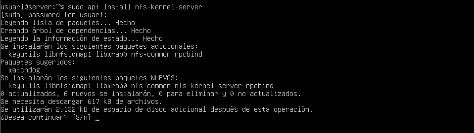

***

## 2) Crear els grups d'accés

Els grups ens permetran controlar qui té permís d’entrar a cada recurs compartit. Crear devs i admins facilita gestionar permisos de manera centralitzada.

```bash
sudo groupadd devs
sudo groupadd admins
```

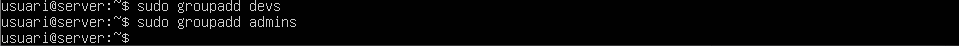

***

## 3) Crear usuaris i assignar-los al seu grup

Creem usuaris de prova i els afegim al grup corresponent.

```bash
# Dev
sudo adduser dev01
sudo adduser dev01 devs

# Admin
sudo adduser admin01
sudo adduser admin01 admins
```

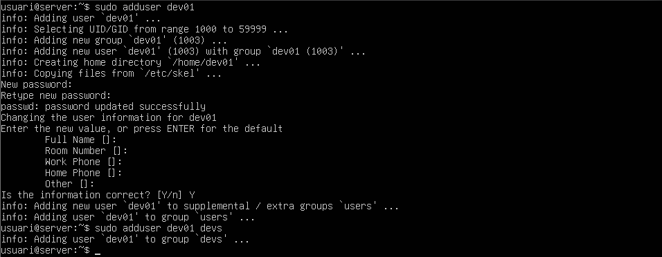
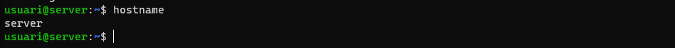

***

## 4) Fixar UIDs

NFS treballa amb UID/GID, no amb noms d’usuari. Fixar aquests números assegura que els permisos són consistents entre servidor i client.
```bash
sudo usermod -u 1001 dev01
sudo usermod -u 1002 admin01
```

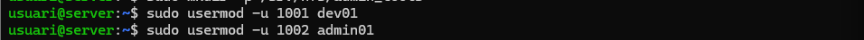

***

## 5) Crear les carpetes que compartirem

Les guardem dins /srv/nfs/, una ruta estàndard per serveis, perquè sigui fàcil de localitzar i gestionar.

```bash
sudo mkdir -p /srv/nfs/dev-projectes
sudo mkdir -p /srv/nfs/admin_tools
```

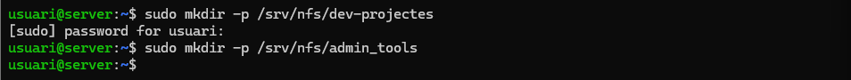

***

## 6) Assignar permisos a dev-projectes

Apliquem el grup devs, i el setgid (2 en 2770) perquè tots els fitxers creats dins la carpeta heretin el grup.

```bash
sudo chown root:devs /srv/nfs/dev-projectes
sudo chmod 2770      /srv/nfs/dev-projectes
```

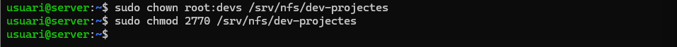

***

## 7) Assignar permisos a admin_tools

Fem el mateix per al grup d’administradors.

```bash
sudo chown root:admins /srv/nfs/admin_tools
sudo chmod 2770        /srv/nfs/admin_tools
```

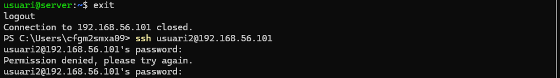

***

## 8) Verificar permisos

Comprovem que els permisos i grups s’han aplicat correctament.
```bash
ls -ld /srv/nfs/dev-projectes /srv/nfs/admin_tools
```

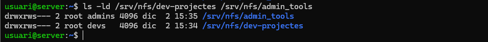

***

## 9) Configurar exportacions a /etc/exports

Definim quins clients poden accedir i amb quines opcions. L’arxiu /etc/exports és la configuració principal de NFS.

```bash
sudo nano /etc/exports
```

Contenido de ejemplo:

    /srv/nfs/admin_tools  192.168.56.106(rw,sync,no_subtree_check,root_squash)
    /srv/nfs/dev-projectes 192.168.56.106(rw,sync,no_subtree_check,root_squash)


***

## 10) Aplicar els canvis d’exportació

Recarreguem les exportacions perquè entrin en vigor.
```bash
sudo exportfs -ra
# (opcional) desexportar temporalmente
sudo exportfs -u /srv/nfs/admin_tools
sudo exportfs -u /srv/nfs/dev-projectes
```


***

## 11) Instal·lar el client NFS

El client només necessita les utilitats bàsiques per muntar recursos NFS.

```bash
sudo apt update
sudo apt install nfs-common
```


***

## 12) Crear grups amb els mateixos GID que al servidor

Per garantir que els permisos coincideixin exactament.

```bash
sudo groupadd -g 1001 devs
sudo groupadd -g 1002 admins
```

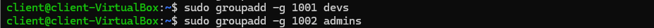

***

## 13) Crear usuaris amb UID fixos

Els UID fixos asseguren que els fitxers es mostren amb la propietat correcta al client.

```bash
sudo useradd -m -u 1001 -g 1001 dev01
sudo useradd -m -u 1002 -g 1002 admin01
```

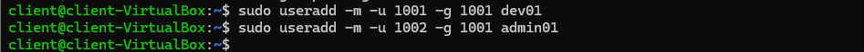

***

## 14) Muntar dev-projectes

Preparem el directori i provem el muntatge manual.

```bash
sudo mkdir -p /mnt/dev-projectes
sudo mount -t nfs 192.168.56.101:/srv/nfs/dev-projectes /mnt/dev-projectes
```

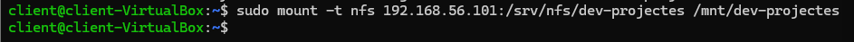

***

## 15) Muntar admin_tools

Repetim el procés per al directori dels administradors.

```bash
sudo mkdir -p /mnt/admin_tools
sudo mount -t nfs 192.168.56.101:/srv/nfs/admin_tools /mnt/admin_tools
```

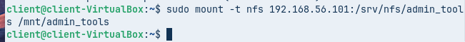

***

## 16) Fer el muntatge permanent a /etc/fstab

Perquè els recursos es muntin automàticament a l’arrencada del sistema.

```bash
sudo nano /etc/fstab
```

Ejemplo:

    192.168.56.101:/srv/nfs/admin_tools  /mnt/admin_tools  nfs  defaults  0 0
    192.168.56.101:/srv/nfs/dev-projectes /mnt/dev-projectes nfs defaults 0 0

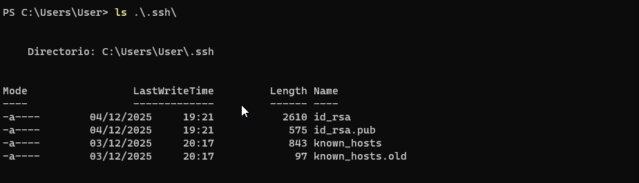

***

## 17) Comprovar mount -a i corregir errors

Si algun punt de muntatge no existeix, cal crear-lo abans.

```bash
sudo mount -a
# Si falla por punto de montaje inexistente:
sudo mkdir -p /mnt/dev-projectes /mnt/admin_tools
sudo systemctl daemon-reload
sudo mount -a
```

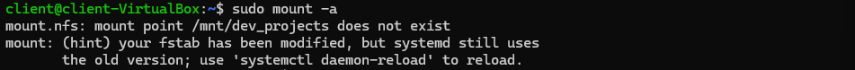

***

## 18) Verificar permisos als recursos

Comprovem que els fitxers nous hereten el grup correcte.

```bash
# Como dev01:
sudo -u dev01 touch /mnt/dev-projectes/prueba_dev.txt
ls -l /mnt/dev-projectes/prueba_dev.txt

# Como admin01:
sudo -u admin01 touch /mnt/admin_tools/prueba_admin.txt
ls -l /mnt/admin_tools/prueba_admin.txt
```


***

## 19) Evitar permisos massa oberts

Mantenim 2770 per assegurar que només el grup té accés.

```bash
sudo chmod 2770 /srv/nfs/admin_tools
sudo chmod 2770 /srv/nfs/dev-projectes
```

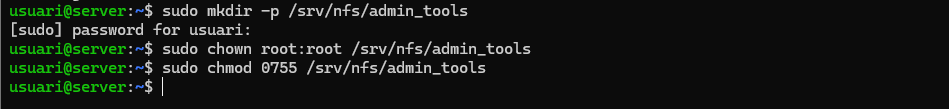

***

## 20) Consulta ràpida d’estat

Per fer diagnòstics ràpids:

```bash
# Servidor
sudo exportfs -v

# Cliente
mount | grep nfs
```

¡Sí! Ese **df -h** sería el **último punto** de la guía.  
Lo añado como **Paso 21: verificación final de montajes y espacio**, con explicación breve y la imagen correspondiente.

***

## 21) Verificació final: muntatges actius i espai

Confirma que els dos recursos NFS estan correctament muntats i que el client veu l’espai disponible. Si apareixen amb la ruta del servidor (per exemple, 192.168.56.101:/srv/nfs/...) i el punt de muntatge (/mnt/...), tot està correcte.

```bash
# Ver el espacio y confirmar los puntos de montaje
df -h | grep /mnt

# (Opcional) ver montajes NFS activos
mount | grep -E 'dev-projectes|admin_tools'
findmnt -t nfs

# (Opcional) prueba rápida de escritura/lectura
sudo -u dev01 touch /mnt/dev-projectes/verificacion.txt
ls -l /mnt/dev-projectes/verificacion.txt
rm /mnt/dev-projectes/verificacion.txt
```

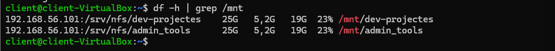

